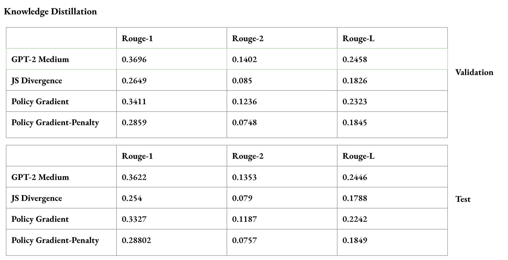
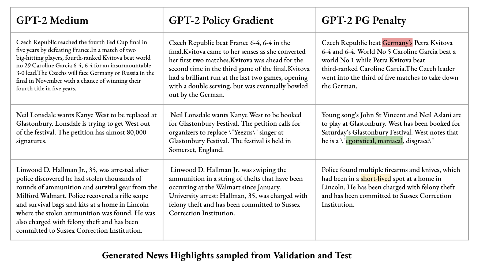
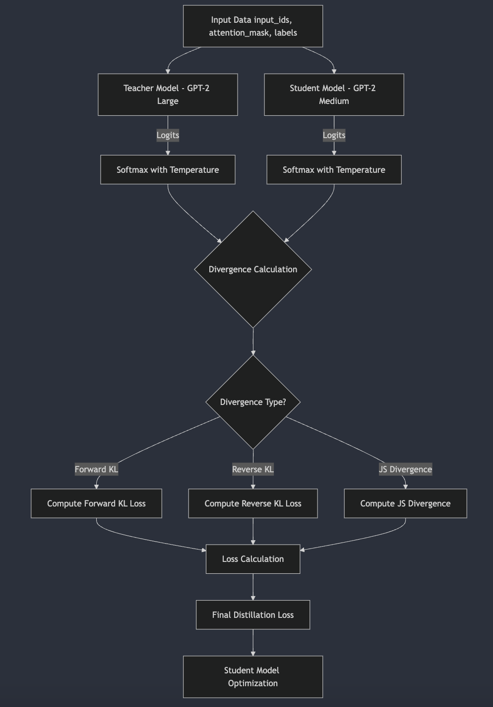
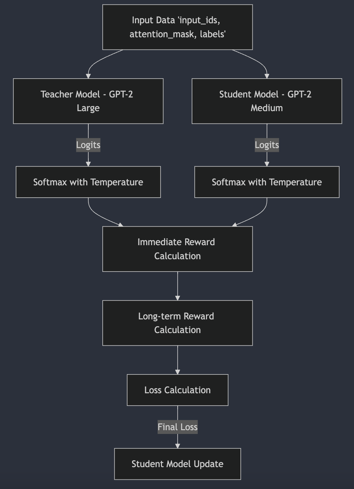
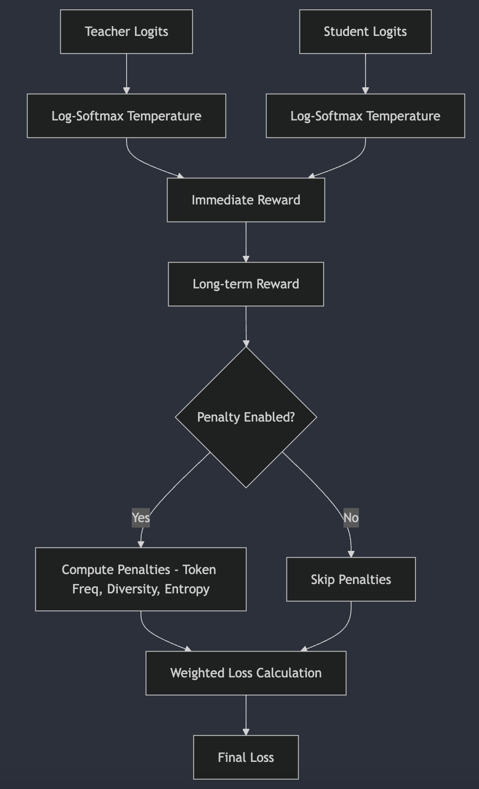

# Knowledge Distillation of Language Models. 

Knowledge Distillation is a popular technique adopted in Deep Learning to distill knowledge from a Teacher (Large) model to a Student (Small) model. 
The intuition is to train the student model that has similar performance to that of the Teacher Model with the added benefits of hosting and running a student 
model on a limited compute hardware. 

The results displayed is of GPT2 Causal Model fine-tuned or KD on the CNN-Dailymail dataset. The CNN/Daily Mail dataset comprises over 300,000 unique English-language news articles from CNN and the Daily Mail. 

The framework supports different types of Knowledge Distillation.

- Divergence Based KD 
    - Forward KL Divergence: Measures how much the student model's predictions diverge from the teacher's output.
    - Reverse KL Divergence: Measures how much the teacher model's predictions diverge from the student's output.
    - Jensen-Shannon (JS) Divergence: A symmetric measure that captures differences between the teacher and student model outputs by calculating the midpoint distribution.

    

- Policy Gradient Based KD (Reward-Based Distillation)

    - Immediate and long-term reward calculations based on log probabilities of teacher and student models. 
    - Weighted learning with normalized long-term rewards for better optimization. 

    - Mixed Sampling Approach: Allows blending teacher and student logits using an adjustable alpha value to smooth learning. Temperature scaling for controlled knowledge transfer.

    - Token Frequency Penalty: Reduces over-reliance on frequently occurring tokens to promote diversity.
    - Diversity Penalty: Ensures diverse generation by measuring Euclidean distances between token embeddings.
    - Entropy Penalty: Encourages balanced token distribution by penalizing low-entropy predictions.    

    
    - Overall Policy Gradient Pipeline
    
    - Overall Policy Gradient Pipeline with Penalty

## Training Instructions 

- Regular Fine-Tuning 

    - modify the following arguments in the `config.json` file.
        - `model_arch["lang_model"]` model name. Either `gpt2` or `gpt2-medium`
        
        - `trainer_kwargs["output_dir"]` path to store training logs and model checkpoints. 
        - `trainer_kwargs["teacher_ckpt_path"]` path to stored Teacher Checkpoint. Necessary to run KD. 
        - `trainer_kwargs["student_ckpt_path"]` path to stored Student Checkpoint. Not Necessary, however helps with resuming training or faster convergence. 
        - `trainer_kwargs["gradient_accumulation_steps"]` increase or decrease this parameter based on the GPU and the `train_batch_size`. 
        
        - `dataset_kwargs["train_batch_size"]` increase or decrease based on the GPU and model size. 
        - `dataset_kwargs["data_dir"]` root directory path of the data.
        - `dataset_kwargs["train_dataset"]` train csv filename.
        - `dataset_kwargs["validation_dataset"]` validation csv filename. 

    - Execute `train.py`. 

- Knowledge Distillation

    - modify the following arguments in the `config_kd.json` file.
        - `model_arch["teacher_lang_model"]` Must be bigger than student model. `gpt2-medium`
        - `model_arch["student_lang_model"]` Must be smaller than teacher model. `gpt2`
        - `model_arch["teacher_gpu_device_id"]` GPU-ID where the Teacher Model resides
        - `model_arch["student_gpu_device_id"]` GPU-ID where the Student Model resides

        - `trainer_kwargs["output_dir"]` path to store training logs and student model checkpoints. 
        - `trainer_kwargs["gradient_accumulation_steps"]` increase or decrease this parameter based on the GPU and the `train_batch_size`. 
        - `dataset_kwargs["train_batch_size"]` increase or decrease based on the GPU and model size. 
        
        - `dataset_kwargs["data_dir"]` root directory path of the data.
        - `dataset_kwargs["train_dataset"]` train csv filename.
        - `dataset_kwargs["validation_dataset"]` validation csv filename.  

    1. Divergence Based Teacher-Student Training. 

    - To execute divergence based teacher-student training. Uncomment or import `from model.teacher_student import TeacherStudent` 
    in `train_kd.py`. 
    - While creating the object of class `TeacherStudent`. Specify the `kl_div`. Choose either 
        - forward
        - reverse
        - JS

    2. Policy Gradient based Teacher-Student Training
    
    - To execute policy gradient based teacher-student training. Uncomment or import `from model.policy_gradient import TeacherStudent` 
    in `train_kd.py`. 
    - While creating the object of class `TeacherStudent`. Specify `penalty`; as boolean paramter. If true, will compute the following
        - frequency penalty
        - diversity penalty
        - entropy penalty

## Validation or Inference Instructions 

This script loads the LM model and performs text generation using Greedy Search Mechanism. A popular algorithm used in search techniques, which estimates the token with the maximum likelihood at each timestep. 

Based on EDA, `max_generation_length` is set to 100. 

- Modify the following within `validate_model.py`. 
    - csv_path : path to the test or validation csv. 
    - model_path : path to the model ckpt. 
    - device_id : GPU device ID. 
    - model_name : modify according to the loaded model `model_path`. Either `gpt2` or `gpt2-medium`. 
    - output_dir : Directory to store the `prediction_json`. 
